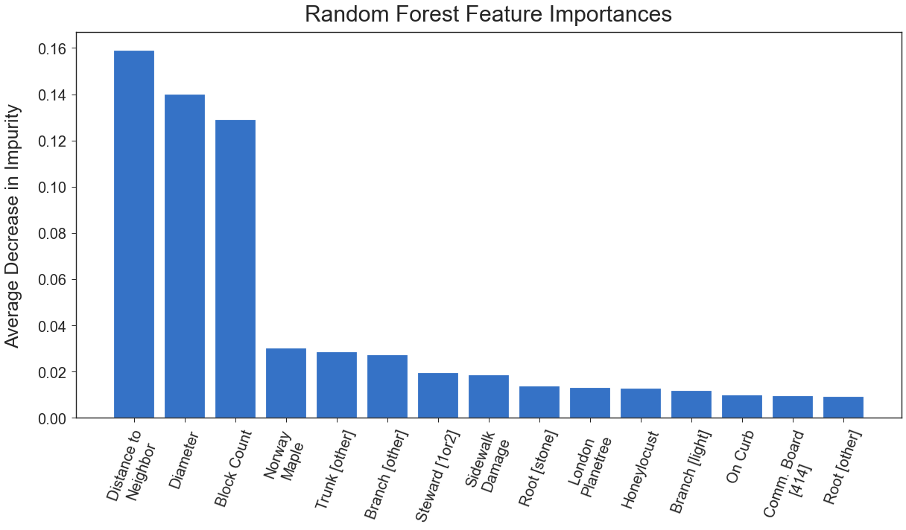

# Verifying Volunteer Entries to the NYC Street Tree Census

## Summary
Using NYC Open Data's [2015 Street Tree Census Data Set](https://data.cityofnewyork.us/Environment/2015-Street-Tree-Census-Tree-Data/pi5s-9p35) (click **Export** to download a non-geospatial version of the dataset), I conduct exploratory data analysis and feature engineering to find the significance of certain variables on the health of NYC street trees.

I then create a classification model to gain further insights into which factors play a role in a tree's health.

Ultimately, my goal is to determine which features most help my model perform well and what information may be helpful for future censuses and policy in general.

In the future, I would like to create a list of volunteer data entries for which the health status does not match that of my model's predictions. This list could be used by professionals to double-check the work of volunteers and re-determine a tree's health if necessary.

## Objectives
1. Investigate any notable differences between professional and volunteer entries to the census.
2. Discover features that are important in determining the health of a tree. Use this information to make policy recommendations.
3. Engineer features to see if any data could be added in future censuses. Additionally, determine if there are there other data that could be collected in the future.
4. Build a classification model using only professional entries to determine the health of a tree. Use it to predict tree health for volunteer entries and compare results with volunteer judgments.
5. Use maps to bolster discoveries, if possible.

## Findings
### 1. Professional entries vs. Volunteer entries

- Volunteers did not make it out to the outer edges of the city and tended to rate trees more poorly (lower rate of *Good*-rated trees compared to professional staff).


#### Tree health breakdown for professional and volunteer entries
|      | Professional | Volunteer |
|:----:|:------------:|:---------:|
| Good | 81.8%        | 79.5%     |
| Fair | 14.2%        | 16.1%     |
| Poor | 4.0%         | 4.4%      |

<br/><br/>
### 2. Discover important features already present in data

- Species of tree is significant, Norway maple having the lowest rate of trees in good health on average, and sawtooth oak having the highest rate.
    - I would recommend sticking to the healthier varieties (toward the right side of the graph seen below) and avoiding the least healthy varieties (toward the left of the graph).
        - *NOTE: graph sorted by proportion of trees in* Good *health, in ascending order.*


- Problems with the tree itself were obviously significant.
    - Unfortunately, problems that were listed as *Other* appear to hold the highest significance.
    - In the next census, I recommend including columns with more specificity or a notes column (which one could analyze using NLP).
    - I suggest conducting more regular maintenance, as well as pushing for environmental protections, in the style of the plastic ban bag.


- All levels of neighborhood delineation held significance.
    - I chose community board as my neighborhood variable in part because one must petition the community board to make changes to street trees.


<br/><br/>
### 3. Feature engineering

- ```block_count``` - the number of trees on the block.
    - I wanted to see if tree density may have anything to do with health, but found no discernible relationship during EDA. My classification model, however, told a different story (see below).
- ```neighbor_dist``` - distance (in meters) to the nearest tree.
    - Similar to the above feature, I wondered if two trees being close together would negatively impact health. Again, during EDA, I found no relationship. And again, my classification model told a different story (see below).

### 4. Modeling

- It's difficult to choose which model to use based off of numbers alone. One must think carefully about how it is being used.
    - I went with a model that was more inaccurate but had a better spread of predictions. Not ready for primetime yet, but a step in the right direction.
    - I created a metric--precision of *Good* predictions--that serves as a fairly good proxy for the results I'm looking for, though more investigation may be necessary.


- Many of the most important features--including, but not limited to, the number of trees on the same block, distance to the nearest tree, and presence of sidewalk damage--didn’t show much significance when looked at during EDA, but must have had solid predictive power after interacting with other branches of the Random Forest trees.

### Top features in the model (in order of average decrease in Gini impurity), out of 147 total features:
    Distance to nearest tree    (15.9%)
    Tree diameter               (14.0%)
    Number of trees on block    (12.9%)
    Species [Norway maple]      (3.0%)
    Trunk problems [other]      (2.8%)
    Branch problems [other]     (2.7%)
    Tree stewards [1-2]         (2.0%)
    Sidewalk damage             (1.8%)
    Root problems [stone]       (1.4%)
    Species [London planetree]  (1.3%)
    Species [Honeylocust]       (1.3%)
    Branch problems [light]     (1.2%)
    On curb                     (1.0%)  
    Community board [414]       (0.9%)
    Root problems [other]       (0.9%)



# Final conclusion
Although I don't think it's ready for rollout just yet, I can run my final model on the data collected by volunteers and compile a list of trees whose health statuses do not match. I could potentially create a better model using a neural network, but that may be too computationally expensive.

Instead, I think the next steps for this project will include transforming this into a binary classification problem (i.e. *Good* vs. *Not Good* by combining trees with *Fair* and *Poor* health status), which would surely improve the model's metrics, while still addressing the project's goals.

In the meantime, the NYC Street Trees Census is fairly thorough and rife with opportunities for data exploration and predictive modeling. In future censuses, even more data could be gathered (especially regarding the specificity of problems with a tree's roots, trunk, and branches) that will improve prediction even further.

## List of files
- **functions.py** - text file with functions for data cleaning and statistical tests.
- **eda_modeling_evaluation.ipynb** - Jupyter Notebook for data exploration and classification modeling.
- **maps_creations.ipynb** - Jupyter Notebook for making maps of NYC street trees.
- **presentation.pdf** - presentation for New York City Department of Parks and Recreation with my findings.
- **archives** folder - scrap notebooks.
- **data** folder - cleaned data and variable descriptions.
- **images** folder - insightful charts and maps from the project.

## Check out my [blog post](https://medium.com/@joshua.szymanowski/new-york-forest-rangers-d11b19e386a8)
